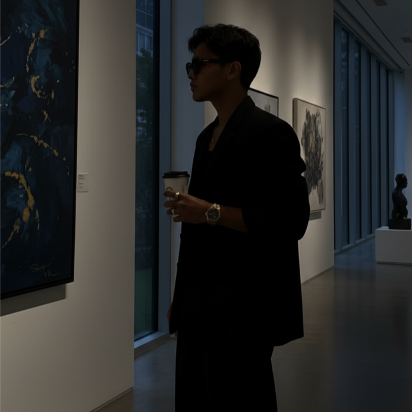
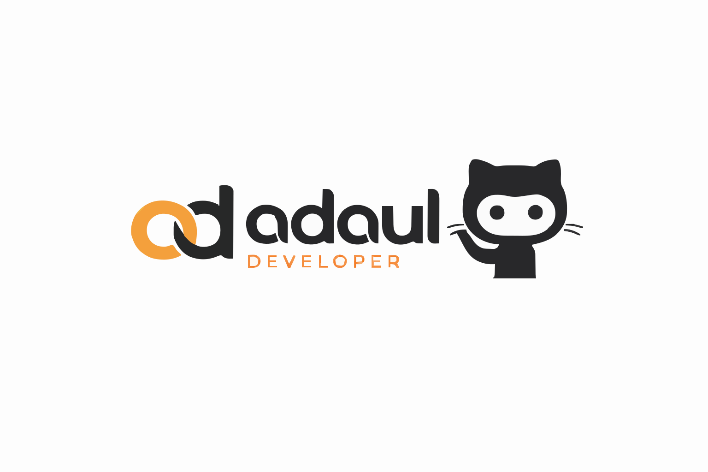

    

  **𝐀𝐫𝐲𝐚 𝐃𝐞𝐤𝐚 𝐀𝐥𝐡𝐚𝐝𝐢𝐝** 
  *Software & System Developer* 
  Focused on structured, scalable, and maintainable digital systems.  

    

  
  
  
  

---

## 𝐎𝐯𝐞𝐫𝐯𝐢𝐞𝐰
Profil ini adalah ringkasan profesional. 
Isinya fokus ke apa yang dikerjakan, bagaimana pendekatan sistemnya, dan arah pengembangan ke depan. 
No gimmick, no noise.

---

## 𝐏𝐫𝐨𝐟𝐞𝐬𝐬𝐢𝐨𝐧𝐚𝐥 𝐅𝐨𝐜𝐮𝐬
Area kerja dan riset utama:

- System & software architecture
- Backend & web application development
- Scalable, maintainable system design
- Research-driven implementation

---

## 👑 𝐑𝐨𝐥𝐞 & 𝐂𝐨𝐦𝐩𝐚𝐧𝐲
**Founder & Direktur Utama — Adaul**  
  

**Lead Developer / Software Engineer — Adaul-Developer**  
  

---

## 🛠️ 𝐓𝐞𝐜𝐡 𝐒𝐭𝐚𝐜𝐤

### Backend & Core

### Frontend & Frameworks

---

## 𝐂𝐨𝐧𝐭𝐚𝐜𝐭
Untuk kolaborasi profesional atau diskusi serius.

---

## 𝐎𝐧𝐥𝐢𝐧𝐞 𝐏𝐫𝐞𝐬𝐞𝐧𝐜𝐞

  
  

